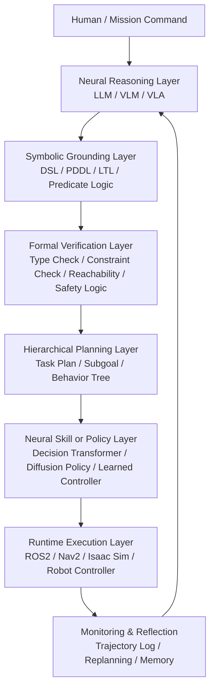
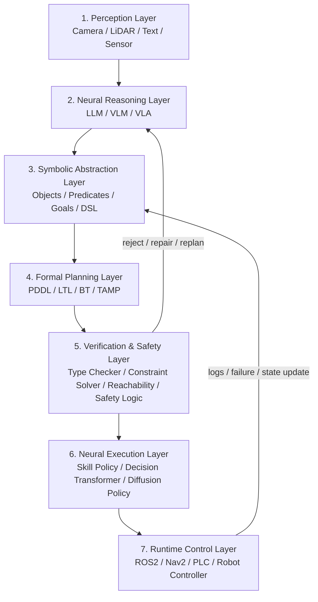
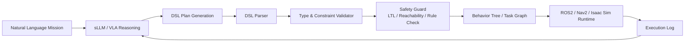

아래는 **2026년 5월 기준 최신 연구 흐름**을 바탕으로 정리한 **Hierarchical Neuro-Symbolic Control Architecture** 연구 동향입니다. 핵심은 다음 한 문장으로 요약할 수 있습니다.

> **LLM/VLA의 확률적 추론 능력을 상위 계층에 두고, PDDL·LTL·DSL·Safety Logic 같은 symbolic layer를 통해 계획을 검증한 뒤, 하위 neural policy/skill/controller가 실제 동작을 수행하는 구조**로 발전하고 있습니다.

---

## 1. 개념 정의

**Hierarchical Neuro-Symbolic Control Architecture**는 로봇이나 자율 시스템을 다음처럼 계층화합니다.

최근 연구들은 “LLM이 직접 로봇을 제어한다”는 방식의 위험성을 줄이고, **LLM은 의도 해석·계획 생성**, **symbolic system은 제약·검증·구조화**, **neural policy는 저수준 실행**을 담당하는 방향으로 이동하고 있습니다. ICRA 2025에서도 “Foundation Models and Neuro-Symbolic AI for Robotics” 워크숍이 별도로 열릴 정도로, Foundation Model과 Neuro-Symbolic Robotics의 결합은 핵심 연구 주제로 부상했습니다. ([IEEE ICRA 2025][1])

---

## 2. 최신 연구 흐름 요약

### 2.1 Symbolic Planner + Neural Policy 구조

가장 전형적인 구조는 **상위 symbolic planner + 하위 neural policy**입니다. 예를 들어 **Hierarchical Neuro-Symbolic Decision Transformer**는 상위 계층에서 classical symbolic planner가 논리적 operator sequence를 만들고, 하위 계층에서는 각 symbolic operator를 sub-goal token으로 변환하여 Decision Transformer가 세부 행동을 생성합니다. 이 방식은 long-horizon decision making, 불확실성, 논리 제약이 있는 환경에서 end-to-end neural policy보다 성공률·샘플 효율·trajectory 효율 측면에서 유리하다고 보고합니다. ([Proceedings of Machine Learning Research][2])

**시사점:** 사용자의 AMR/DSL 연구 관점에서는 `mission → seq/sel/par/retry/recover → act` 같은 DSL 구조가 바로 symbolic operator layer 역할을 할 수 있고, VLA/Decision Transformer는 각 `act`를 실제 motion primitive로 실행하는 하위 계층이 됩니다.

---

### 2.2 LLM/VLA + Hierarchical World Model

2026년 연구인 **H-WM: Robotic Task and Motion Planning Guided by Hierarchical World Model**은 high-level logical world model과 low-level visual world model을 결합합니다. 이 구조는 symbolic state transition과 visual state evolution을 함께 예측하여, VLA 모델이 long-horizon task에서 error accumulation을 줄이고 더 안정적으로 실행되도록 중간 guidance를 제공합니다. ([arXiv][3])

**핵심 변화:** 기존 VLA는 이미지·언어 입력에서 바로 action을 예측하는 경향이 강했지만, 최신 흐름은 VLA 앞뒤에 **논리 상태, symbolic state, intermediate subgoal**을 삽입하여 장기 작업의 안정성을 높이는 방향입니다.

---

### 2.3 LLM Reasoning을 Temporal Logic으로 Grounding

**LLM-Grounded Dynamic Task Planning with Hierarchical Temporal Logic**은 LLM의 자연어 추론을 **Hierarchical LTL over finite traces, H-LTLf** 명세로 변환하고, 이를 multi-robot task allocation and planning 문제에 연결합니다. 또한 receding horizon planning loop를 사용하여 이동하는 사람, 변경된 지시, 환경 변화 같은 stochastic change에 동적으로 대응합니다. 실제 human-aware multi-robot 환경 실험에서 성공률, interaction fluency, planning latency를 개선했다고 보고합니다. ([arXiv][4])

**시사점:** AMR/특장차/제조공정 DSL에도 `always`, `until`, `eventually`, `avoid`, `recover` 같은 temporal constraint를 명시적으로 넣으면, LLM 출력의 안전성과 실행 가능성을 높일 수 있습니다.

---

### 2.4 Code-as-Symbolic-Planner

**Code-as-Symbolic-Planner**는 LLM이 단순히 plan text를 생성하는 것이 아니라, **solver, planner, checker 역할을 하는 symbolic code**를 생성하도록 유도합니다. 이 연구는 TAMP(Task and Motion Planning)에서 LLM의 code generation 능력을 활용하여 optimization과 constraint verification을 수행하며, 7개 TAMP task와 여러 LLM에서 best baseline 대비 평균 성공률을 24.1% 개선했다고 보고합니다. ([arXiv][5])

**시사점:** DSL runtime 설계 시, LLM이 직접 actuator command를 내지 않고 `validated_plan.py`, `dsl_plan.json`, `pddl_problem`, `bt.xml` 같은 **검증 가능한 중간 산출물**을 생성하게 하는 방식이 강력합니다.

---

### 2.5 Multi-Level Goal Decomposition

ICRA 2025 계열 연구인 **Fast and Accurate Task Planning using Neuro-Symbolic Language Models and Multi-level Goal Decomposition**은 복잡한 long-sequential task를 LLM이 subgoal로 분해하고, 각 subgoal의 복잡도에 따라 symbolic planner 또는 MCTS-based LLM planner를 선택하는 구조를 제안합니다. 목표는 symbolic planner의 탐색 공간 폭발 문제와 LLM planner의 낮은 정확도 문제를 동시에 줄이는 것입니다. ([GLAB][6])

**시사점:** AMR DSL에서는 `mission`을 바로 저수준 명령으로 내리는 것이 아니라, `mission → phase → subgoal → act`로 나누는 것이 좋습니다. 예를 들어 “Zone-A 이동 후 장애물 회피, 대기, 복귀”는 하나의 plan이 아니라 여러 검증 가능한 subgoal sequence로 분해해야 합니다.

---

### 2.6 Planning–Verification–Execution–Reflection Agent

**Metagent-P**는 LLM의 world knowledge, cognitive architecture의 symbolic reasoning, metacognition 기반 self-reflection을 결합하여 **planning–verification–execution–reflection** 프레임워크를 제안합니다. 이 구조는 multimodal memory를 활용하고, 계획의 reasoning correctness를 보장하기 위해 neural-symbolic hierarchical representation을 사용합니다. ([ACL Anthology][7])

**시사점:** 로봇 제어뿐 아니라 Trading Agent, CS Agent, 제조공정 Agent에도 적용 가능합니다. 핵심은 단발성 계획 생성이 아니라, 실행 로그를 기반으로 `plan → verify → execute → reflect → replan` 루프를 만드는 것입니다.

---

## 3. 안전성 연구 흐름: Formal Guard / Safety Logic / Reachability

최근 연구에서 가장 중요한 변화는 **LLM/VLA 출력에 대한 runtime safety shield**입니다.

**Safe LLM-Controlled Robots with Formal Guarantees via Reachability Analysis**는 LLM 제어 로봇의 모든 가능한 trajectory가 안전 운용 한계 안에 머무는지 data-driven reachability analysis로 검증하는 프레임워크를 제안합니다. 이는 LLM의 확률적 출력이 안전-critical robot control에서 직접 실행되는 위험을 줄이려는 접근입니다. ([arXiv][8])

**LogicGuard**는 LLM actor와 trajectory-level LLM critic을 분리하고, critic이 Linear Temporal Logic constraint를 생성하여 long-horizon task에서 unsafe 또는 inefficient behavior를 줄이는 modular actor–critic 구조를 제안합니다. Behavior benchmark와 Minecraft diamond-mining task에서 completion rate, efficiency, safety 개선을 보고합니다. ([arXiv][9])

**RoboSafe**는 VLM 기반 embodied agent의 runtime guardrail로, executable predicate-based safety logic을 사용합니다. Backward Reflective Reasoning은 최근 trajectory를 되돌아보며 temporal risk를 탐지하고, Forward Predictive Reasoning은 다음 action의 위험을 예측하여 replanning을 유도합니다. ([arXiv][10])

---

## 4. 연구별 핵심 비교

| 연구 방향                            | 대표 연구                                            | 핵심 구조                                                     | 강점                           | 한계                                 |
| -------------------------------- | ------------------------------------------------ | --------------------------------------------------------- | ---------------------------- | ---------------------------------- |
| Symbolic Planner + Neural Policy | Hierarchical Neuro-Symbolic Decision Transformer | PDDL/logic planner → subgoal token → Decision Transformer | long-horizon, 논리 제약, 해석 가능성  | symbolic domain 정의 필요              |
| VLA + Hierarchical World Model   | H-WM                                             | logical world model + visual world model                  | VLA의 장기 오류 누적 완화             | symbolic-visual aligned dataset 필요 |
| LLM + Temporal Logic             | H-LTLf Dynamic Task Planning                     | LLM → hierarchical LTL → STAP/RHP                         | 다중 로봇, 동적 환경 대응              | LTL 명세 설계 난이도                      |
| LLM as Symbolic Code Generator   | Code-as-Symbolic-Planner                         | LLM → solver/planner/checker code                         | constraint solving, TAMP 일반화 | 생성 code 검증 체계 필요                   |
| Goal Decomposition               | Multi-level Goal Decomposition                   | complex mission → subgoals → planner 선택                   | planning search space 축소     | subgoal quality에 의존                |
| Safety Shield                    | LogicGuard / RoboSafe / Reachability             | LLM/VLA output → safety logic / reachability filter       | 안전성·검증성 향상                   | 실시간성·계산 비용 이슈                      |
| Reflection Agent                 | Metagent-P                                       | plan–verify–execute–reflect                               | self-improvement, memory 활용  | open-world evaluation complexity   |

---

## 5. 공통 아키텍처 패턴

최근 연구들을 종합하면, 실용적인 계층형 neuro-symbolic control architecture는 다음 7계층으로 정리할 수 있습니다.

이 구조의 본질은 **“확률적 지능은 상위 인지 계층에, 결정적 검증과 실행은 하위 제어 계층에”** 배치하는 것입니다.

---

## 6. DSL 관점에서의 해석

사용자님의 AMR DSL 연구와 직접 연결하면, 최신 연구는 다음 구조를 강하게 지지합니다.

즉, 논문에서 주장할 수 있는 구조는 다음과 같습니다.

> **LLM/VLA는 직접 actuator를 제어하지 않는다. LLM/VLA는 symbolic DSL plan을 생성하고, DSL validator와 safety guard가 이를 검증한 후, runtime이 제한된 action primitive로만 실행한다.**

이 주장은 HNS Decision Transformer의 symbolic planner + neural policy 구조, H-WM의 logical/visual hierarchical world model, H-LTLf 기반 dynamic task planning, LogicGuard/RoboSafe의 executable safety logic 흐름과 잘 맞습니다. ([arXiv][11])

---

## 7. 연구 공백과 기회

현재 연구의 공백은 다음과 같습니다.

첫째, 많은 연구가 PDDL, LTL, symbolic predicate를 사용하지만, **로봇 도메인 전용 DSL을 명시적으로 설계하고 guided decoding과 runtime validation까지 연결한 구조**는 아직 충분히 표준화되지 않았습니다.

둘째, VLA 연구는 강력한 end-to-end policy 성능을 보이지만, long-horizon task에서는 error accumulation, unsafe action, hallucinated subgoal 문제가 남아 있습니다. H-WM 같은 연구가 이 문제를 logical world model로 보완하려는 시도입니다. ([arXiv][3])

셋째, safety 연구는 LTL, reachability, executable safety logic으로 발전하고 있지만, 실제 ROS2/Nav2/Isaac Sim runtime에서 **실시간 DSL safety shield**로 구현하는 통합 사례는 아직 연구 기회가 큽니다.

넷째, plan–execute–reflect 구조는 Metagent-P와 LogicGuard 계열에서 강화되고 있으나, 로봇 제어에서는 reflection 결과를 DSL grammar, validator rule, policy update로 어떻게 반영할지에 대한 체계적 방법론이 더 필요합니다. ([ACL Anthology][7])

---

## 8. 논문/실험 설계에 대한 추천 방향

사용자님의 **“DSL-Guided Decoding for sLLM-based Robotics”** 연구에는 다음 방향이 가장 적합합니다.

1. **sLLM/VLA는 자연어 → DSL 생성까지만 담당**
2. **DSL grammar와 JSON schema로 guided decoding 적용**
3. **DSL Parser가 syntax/type/semantic validation 수행**
4. **Safety Guard가 속도, 금지구역, 충돌위험, temporal constraint 검증**
5. **Behavior Tree 또는 ROS2 action graph로 변환**
6. **Isaac Sim에서 direct sLLM 제어와 DSL-constrained 제어 비교**
7. **평가 지표는 abnormal command pass-through rate, mission success rate, replanning count, latency, safety violation count로 구성**

이렇게 구성하면 최신 연구 흐름인 **Neural Reasoning + Symbolic Grounding + Formal Safety + Neural Execution**을 모두 반영하면서도, DSL 기반 로봇 제어라는 차별성이 분명해집니다.

[1]: https://2025.ieee-icra.org/event/foundation-models-and-neuro-symbolic-ai-for-robotics/?utm_source=chatgpt.com "Foundation Models and Neuro-Symbolic AI for Robotics"
[2]: https://proceedings.mlr.press/v284/baheri25a.html?utm_source=chatgpt.com "Hierarchical Neuro-Symbolic Decision Transformer"
[3]: https://arxiv.org/abs/2602.11291?utm_source=chatgpt.com "H-WM: Robotic Task and Motion Planning Guided by Hierarchical World Model"
[4]: https://arxiv.org/abs/2602.09472?utm_source=chatgpt.com "LLM-Grounded Dynamic Task Planning with Hierarchical Temporal Logic for Human-Aware Multi-Robot Collaboration"
[5]: https://arxiv.org/abs/2503.01700?utm_source=chatgpt.com "Code-as-Symbolic-Planner: Foundation Model-Based Robot Planning via Symbolic Code Generation"
[6]: https://graphics.ewha.ac.kr/LLMTAMP/ICRA2025.pdf?utm_source=chatgpt.com "Fast and Accurate Task Planning Using Neuro-Symbolic ..."
[7]: https://aclanthology.org/2025.findings-acl.1169/?utm_source=chatgpt.com "Metagent-P: A Neuro-Symbolic Planning Agent with ..."
[8]: https://arxiv.org/abs/2503.03911?utm_source=chatgpt.com "Safe LLM-Controlled Robots with Formal Guarantees via Reachability Analysis"
[9]: https://arxiv.org/abs/2507.03293?utm_source=chatgpt.com "LogicGuard: Improving Embodied LLM agents through Temporal Logic based Critics"
[10]: https://arxiv.org/abs/2512.21220?utm_source=chatgpt.com "RoboSafe: Safeguarding Embodied Agents via Executable Safety Logic"
[11]: https://arxiv.org/abs/2503.07148?utm_source=chatgpt.com "Hierarchical Neuro-Symbolic Decision Transformer"
